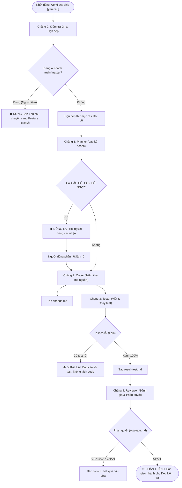

# TemplateAI — Multi-Agent Development Pipeline Template

> **Khung làm việc chuẩn hóa quy trình phát triển phần mềm tự động với dây chuyền 4 Subagents độc lập (Planner → Coder → Tester → Reviewer) dành cho AI Coding Assistants (Gemini / Antigravity & Codex).**

---

## 📌 Mục lục
1. [Giới thiệu tổng quan](#-giới-thiệu-tổng-quan)
2. [Cấu trúc dự án & Phân luồng độc lập](#-cấu-trúc-dự-án--phân-luồng-độc-lập)
3. [Quy trình hoạt động toàn diện (Full Flow)](#-quy-trình-hoạt-động-toàn-diện-full-flow)
4. [Nhiệm vụ & Quyền hạn của 4 Subagents](#-nhiệm-vụ--quyền-hạn-của-4-subagents)
5. [Quy cách các File bàn giao (Artifacts)](#-quy-cách-các-file-bàn-giao-artifacts)
6. [Hướng dẫn cài đặt & Tích hợp vào dự án](#-hướng-dẫn-cài-đặt--tích-hợp-vào-dự-án)
7. [Hướng dẫn sử dụng](#-hướng-dẫn-sử-dụng)
8. [Tiện ích & Giá trị mang lại](#-tiện-ích--giá-trị-mang-lại)
9. [Xử lý sự cố thường gặp (FAQ & Troubleshooting)](#-xử-lý-sự-cố-thường-gặp-faq--troubleshooting)

---

## 🌟 Giới thiệu tổng quan

Trong phát triển phần mềm với AI, việc để một AI duy nhất vừa lập kế hoạch, vừa viết code, vừa tự test và tự duyệt thường dẫn đến hiện tượng **"vừa đá bóng vừa thổi còi"**, sinh ra code ảo giác (hallucination), thiếu test case biên hoặc phá vỡ các quy ước sẵn có của dự án.

**TemplateAI** giải quyết triệt để vấn đề này bằng cách thiết lập một dây chuyền làm việc khép kín gồm **4 Subagents chuyên biệt**, hoạt động tuần tự theo phương pháp **Spec-Driven Development (SDD)**:
- **Planner**: Khảo sát và lập kế hoạch kỹ thuật chi tiết (không viết code).
- **Coder**: Hiện thực hóa đúng và đủ theo kế hoạch đã chốt (không làm thừa, không tự đoán).
- **Tester**: Viết và chạy test độc lập (không sửa code sản phẩm để lách test).
- **Reviewer**: Đánh giá toàn diện mã nguồn, test và đưa ra phán quyết cuối cùng (chỉ đọc, không can thiệp code).

Ngoài ra, template cung cấp cơ chế **Phân luồng độc lập (Workspace Isolation)** giữa hai hệ sinh thái AI phổ biến: **Gemini (Antigravity)** và **Codex**, đảm bảo không xung đột dữ liệu hay can thiệp chéo.

---

## 📂 Cấu trúc dự án & Phân luồng độc lập

### Sơ đồ cấu trúc thư mục
```text
TemplateAI/
├── .agents/
│   └── skills/
│       └── ship/
│           └── SKILL.md             # Định nghĩa Skill "ship" cho Antigravity / Gemini
├── PromtAI/
│   ├── .gemini/                     # Không gian làm việc riêng của GEMINI / ANTIGRAVITY
│   │   ├── agents/                  # System prompts định nghĩa vai trò của 4 subagents
│   │   │   ├── planner.md
│   │   │   ├── coder.md
│   │   │   ├── tester.md
│   │   │   └── reviewer.md
│   │   ├── commands/                # Kịch bản thực thi lệnh (ship workflow)
│   │   │   └── ship.md
│   │   ├── results/                 # Nơi bàn giao artifacts giữa các chặng
│   │   │   ├── plan.md              # Kế hoạch từ Planner
│   │   │   ├── change.md            # Tóm tắt thay đổi từ Coder
│   │   │   ├── result-test.md       # Kết quả chạy test từ Tester
│   │   │   └── evaluate.md          # Phán quyết từ Reviewer
│   │   └── GEMINI.md                # Chỉ dẫn định danh môi trường Gemini
│   │
│   └── .codex/                      # Không gian làm việc riêng của CODEX
│       ├── agents/                  # Định nghĩa vai trò cho Codex
│       ├── commands/                # Kịch bản thực thi cho Codex
│       └── results/                 # Nơi lưu kết quả bàn giao của Codex
│
├── AGENTS.md                        # Quy tắc phân luồng định danh tổng quát
├── GEMINI.md                        # Chỉ dẫn root cho môi trường Gemini
├── CODEX.md                         # Chỉ dẫn root cho môi trường Codex
└── README.md                        # Tài liệu hướng dẫn sử dụng dự án
```

### Quy tắc phân luồng độc lập (Workspace Routing)
Mỗi môi trường AI bắt buộc xác định danh tính và tuân thủ ranh giới làm việc:
1. **Môi trường GEMINI / ANTIGRAVITY**:
   - Chỉ được đọc và ghi trong `PromtAI/.gemini/` và `.agents/skills/ship/`.
   - Đọc kịch bản: `PromtAI/.gemini/commands/`.
   - Đọc vai trò: `PromtAI/.gemini/agents/`.
   - Đọc/ghi kết quả: `PromtAI/.gemini/results/`.
   - **Tuyệt đối CẤM**: Không truy cập vào `PromtAI/.codex/`, không xuất file ra `.gemini/` hay `results/` ngoài root.
2. **Môi trường CODEX**:
   - Chỉ được đọc và ghi trong `PromtAI/.codex/`.
   - **Tuyệt đối CẤM**: Không truy cập vào `PromtAI/.gemini/`, không xuất file ra `.codex/` hay `results/` ngoài root.

---

## 🔄 Quy trình hoạt động toàn diện (Full Flow)

Dây chuyền **Ship Workflow** thực thi tuần tự qua 5 chặng (từ Chặng 0 đến Chặng 4), không nhảy cóc, có điểm dừng kiểm định (checkpoints) rõ ràng:



### Chi tiết các chặng thực hiện:

#### Chặng 0: Kiểm tra Git Branch & Dọn dẹp môi trường
- **Mục tiêu**: Bảo vệ nhánh chính và đảm bảo tính cô lập dữ liệu của từng lần chạy.
- **Hành động**:
  1. Chạy lệnh kiểm tra nhánh Git: `git branch --show-current`.
  2. Nếu đang đứng trên `main` hoặc `master`, **DỪNG LẠI NGAY** để bảo vệ an toàn mã nguồn.
  3. Dọn sạch các file kết quả cũ trong `PromtAI/.gemini/results/` (`plan.md`, `change.md`, `result-test.md`, `evaluate.md`).

#### Chặng 1: Planner (Phân tích & Lập kế hoạch)
- **Mục tiêu**: Khảo sát mã nguồn hiện tại, quy chuẩn thiết kế, thư viện có sẵn để lập kế hoạch triển khai.
- **Hành động**:
  - Nghiên cứu codebase (đặt tên, cấu trúc thư mục, test framework, conventions).
  - Xuất file kế hoạch ra `plan.md`.
  - Nếu yêu cầu có chỗ mơ hồ, tạo mục **CÂU HỎI CÒN BỎ NGỎ** lên đầu file và **DỪNG LẠI** chờ người dùng làm rõ.

#### Chặng 2: Coder (Triển khai code)
- **Mục tiêu**: Viết code đúng theo bản kế hoạch đã chốt.
- **Hành động**:
  - Đọc `plan.md`. Chỉ thực hiện đúng phạm vi yêu cầu, bám sát coding convention của dự án.
  - Không tự tiện "tối ưu", dọn dẹp hoặc thêm tính năng ngoài lề.
  - Viết tóm tắt các file đã sửa/tạo mới vào `change.md`, ghi chú các điểm Tester cần soi kỹ.

#### Chặng 3: Tester (Viết và chạy test)
- **Mục tiêu**: Đảm bảo chất lượng bằng việc viết kiểm thử khách quan.
- **Hành động**:
  - Đọc `change.md` và `plan.md`.
  - Viết test bao gồm 3 nhóm: Luồng chuẩn (happy path), các trường hợp biên (edge cases), và kịch bản bắt buộc lỗi (expected fail).
  - Chạy test:
    - Nếu có test rớt: Ghi log lỗi vào `result-test.md` và **DỪNG LẠI**. Tuyệt đối **KHÔNG** sửa code sản phẩm để lách test xanh.
    - Nếu test xanh toàn bộ: Bàn giao kết quả kiểm thử.

#### Chặng 4: Reviewer (Đánh giá và phán quyết)
- **Mục tiêu**: Tuyến phòng thủ chất lượng cuối cùng trước khi bàn giao cho con người.
- **Hành động**:
  - Đọc toàn bộ các file kết quả và chạy `git diff` để kiểm tra từng dòng thay đổi.
  - Trả lời 3 câu hỏi bắt buộc:
    1. Code có khớp chính xác bản kế hoạch không?
    2. Test có giá trị thực tế hay chỉ viết cho có?
    3. Có tồn tại lỗ hổng bảo mật, suy giảm hiệu năng hay lỗi logic không?
  - Xuất file `evaluate.md` với định dạng bắt buộc dòng đầu:
    ```text
    PHAN QUYET: CHOT / CAN SUA / CHAN
    ```
- **Handoff (Bàn giao)**: Không tự ý merge nhánh, không commit/push git, không tạo PR. Giữ nguyên nhánh làm việc để lập trình viên tự kiểm chứng.

---

## 👥 Nhiệm vụ & Quyền hạn của 4 Subagents

| Subagent | Vai trò chính | Công cụ được cấp (Tools) | Ranh giới & Giới hạn bắt buộc | File bàn giao |
| :--- | :--- | :--- | :--- | :--- |
| **Planner** | Phân tích & Lên kiến trúc, kế hoạch | `Read`, `Grep`, `Glob`, `Write` | **KHÔNG** viết code sản phẩm. Không đoán mò yêu cầu mơ hồ. | `results/plan.md` |
| **Coder** | Lập trình hiện thực hóa kế hoạch | `Read`, `Write`, `Edit`, `Grep`, `Glob`, `Bash` | **KHÔNG** sửa code ngoài phạm vi kế hoạch. Không thêm tính năng không yêu cầu. | `results/change.md` |
| **Tester** | Thiết kế test case & Chạy kiểm thử | `Read`, `Write`, `Edit`, `Grep`, `Glob`, `Bash` | **CHỈ** tạo/sửa file test. **KHÔNG** sửa code sản phẩm dù biết cách sửa. | `results/result-test.md` |
| **Reviewer** | Đánh giá độc lập & Phán quyết | `Read`, `Grep`, `Glob`, `Bash` (Read-only) | **CHỈ ĐỌC**. Không sửa file. Không chạy lệnh thay đổi git/hệ thống. | `results/evaluate.md` |

---

## 📑 Quy cách các File bàn giao (Artifacts)

Tất cả các file bàn giao nằm tập trung trong `PromtAI/.gemini/results/` (hoặc `PromtAI/.codex/results/`):

### 1. `plan.md` (Kế hoạch từ Planner)
- **CÂU HỎI CÒN BỎ NGỎ**: Liệt kê câu hỏi cần làm rõ với người dùng (nếu có).
- **Danh sách file**: Đường dẫn file cần tạo mới hoặc sửa đổi.
- **Chữ ký hàm / Interface**: Thiết kế chi tiết hàm, kiểu dữ liệu.
- **Trường hợp biên (Edge Cases)**: Xử lý null, ngoại lệ, dữ liệu rỗng, tràn số,...
- **Quy ước tham chiếu**: Chỉ rõ file mẫu trong repo để copy convention.

### 2. `change.md` (Báo cáo từ Coder)
- **File đã thay đổi**: Danh sách file và tóm tắt mục đích sửa đổi.
- **Vị trí cần soi kỹ (Watchouts for Tester)**: Những đoạn logic phức tạp, thuật toán hoặc xử lý bất đồng bộ cần được kiểm tra kỹ.

### 3. `result-test.md` (Báo cáo từ Tester)
- **Chi tiết test case**: Danh sách các test đã viết (Happy path, Edge case, Fail case).
- **Kết quả thực thi**: Output của test suite (PASS/FAIL).
- **Trạng thái**: Ghi nhận lỗi chi tiết nếu có kiểm thử thất bại.

### 4. `evaluate.md` (Phán quyết từ Reviewer)
- **Dòng 1 bắt buộc**: `PHAN QUYET: CHOT` hoặc `PHAN QUYET: CAN SUA` hoặc `PHAN QUYET: CHAN`.
- **Nhận xét 3 câu hỏi cốt lõi**: Khớp kế hoạch, giá trị test, tính đúng đắn & an toàn.
- **Danh sách hạng mục cần sửa**: Nêu đích danh file, số dòng và cách sửa (nếu trạng thái là `CAN SUA` hoặc `CHAN`).

---

## 🚀 Hướng dẫn cài đặt & Tích hợp vào dự án

### Cách 1: Sử dụng trực tiếp TemplateAI cho dự án mới
1. Clone hoặc tải project này về máy:
   ```bash
   git clone <repo-url> MyNewProject
   cd MyNewProject
   ```
2. Khởi tạo Git nếu chưa có:
   ```bash
   git init
   git checkout -b feature/initial-setup
   ```

### Cách 2: Tích hợp vào dự án hiện có
Để tích hợp dây chuyền Multi-Agent vào một dự án bạn đang làm, chỉ cần copy các thư mục và file sau vào thư mục gốc (root) của dự án:
- Thư mục `.agents/` (chứa skill `ship`)
- Thư mục `PromtAI/` (chứa các agents, commands, kết quả của `.gemini` và `.codex`)
- Các file quy chuẩn: `AGENTS.md`, `GEMINI.md`, `CODEX.md`

Cấu trúc lệnh sao chép (PowerShell ví dụ):
```powershell
Copy-Item -Recurse -Path "TemplateAI\.agents" -Destination "MyExistingProject\"
Copy-Item -Recurse -Path "TemplateAI\PromtAI" -Destination "MyExistingProject\"
Copy-Item -Path "TemplateAI\AGENTS.md", "TemplateAI\GEMINI.md", "TemplateAI\CODEX.md" -Destination "MyExistingProject\"
```

### Điều kiện tiên quyết của môi trường:
- **Git**: Đã cài đặt và repo đã khởi tạo git tracking.
- **Công cụ dòng lệnh / Runtime**: Tương ứng với ngôn ngữ dự án (Node.js/npm, Python/pytest, .NET/dotnet test, Go/go test, v.v.).
- **AI Environment**: 
  - Đã kích hoạt Antigravity / Gemini CLI với quyền chạy subagent và công cụ dòng lệnh (Bash/PowerShell).
  - Hoặc Codex / AI Agent tương thích.

---

## 💻 Hướng dẫn sử dụng

### 1. Chuẩn bị trước khi chạy
Tạo và chuyển sang một nhánh tính năng riêng:
```bash
git checkout -b feature/user-authentication
```

### 2. Kích hoạt dây chuyền phát triển

#### Cách A: Sử dụng Skill Ship (Khuyên dùng trên Antigravity / Gemini)
Trong khung chat với AI Assistant, gõ lệnh hoặc mô tả tính năng:
```text
@ship Xây dựng API xác thực JWT đăng nhập cho người dùng kèm middleware phân quyền
```
hoặc:
```text
Chạy workflow ship: Tạo tính năng xuất báo cáo doanh thu ra định dạng CSV và Excel
```

#### Cách B: Thực thi thông qua Command file
AI sẽ tự động đọc kịch bản tại `PromtAI/.gemini/commands/ship.md` và khởi động 4 subagent theo dây chuyền.

### 3. Tương tác trong quá trình chạy
- **Nếu Planner dừng lại với câu hỏi còn bỏ ngỏ**: Bạn cung cấp câu trả lời/làm rõ nghiệp vụ ngay trong chat. Coder sẽ tiếp nhận sau khi có xác nhận.
- **Nếu Tester báo test fail**: Hệ thống sẽ hiển thị lỗi kiểm thử. Bạn có thể kiểm tra xem logic nghiệp vụ sai hay code sai.
- **Sau khi Reviewer đưa ra `PHAN QUYET: CHOT`**:
  Kiểm tra lại toàn bộ nhánh:
  ```bash
  git status
  git diff
  ```
  Tiến hành commit và gộp nhánh theo quy trình của bạn:
  ```bash
  git add .
  git commit -m "feat: complete user authentication pipeline"
  ```

---

## 💎 Tiện ích & Giá trị mang lại

1. **Triệt tiêu ảo giác (Anti-Hallucination by Separation of Duties)**:
   Mỗi agent chỉ làm đúng việc của mình. Coder không tự tiện phóng đại tính năng; Tester chỉ tập trung bẻ gãy code; Reviewer đứng độc lập soi lỗi.
2. **Bảo vệ mã nguồn tuyệt đối (Safety & Gatekeeping)**:
   Workflow chủ động chặn chạy trên `main`/`master`, không tự động merge/push, đảm bảo quyền kiểm soát cuối cùng luôn thuộc về lập trình viên con người.
3. **Phân luồng độc lập, tránh xung đột (Clean Workspace Routing)**:
   Cấu trúc phân tách rạch ròi giữa Gemini và Codex giúp bạn linh hoạt thử nghiệm cả hai nền tảng AI mà không sợ ghi đè cấu hình hay mất dữ liệu.
4. **Minh bạch và truy vết 100% (Full Traceability)**:
   Mọi quyết định thiết kế, tóm tắt thay đổi mã nguồn, kết quả kiểm thử và nhận xét review đều được lưu vết dạng Markdown tại `results/`.
5. **Tiết kiệm thời gian & Tự động hóa kiểm thử**:
   Tester tự động sinh test cases bao quát edge cases, giảm thiểu lỗi tiềm ẩn trước khi đưa lên môi trường staging.

---

## ❓ Xử lý sự cố thường gặp (FAQ & Troubleshooting)

### Q1: Vì sao AI vừa chạy đã dừng ngay ở Chặng 0?
> **Trả lời**: Kiểm tra nhánh git hiện tại bằng `git branch --show-current`. Nếu đang ở `main` hoặc `master`, quy tắc an toàn của `ship` sẽ chủ động dừng lại. Bạn chỉ cần gõ `git checkout -b feature/<ten-tinh-nang>` rồi chạy lại.

### Q2: Vì sao Planner dừng lại không bàn giao cho Coder?
> **Trả lời**: Bản thiết kế của Planner đang phát hiện điểm mơ hồ (ambiguity) và đã tạo mục **CÂU HỎI CÒN BỎ NGỎ** trong `plan.md`. Hãy trả lời các câu hỏi đó để Coder có đủ căn cứ hiện thực hóa mã nguồn chuẩn xác.

### Q3: Phải làm sao khi Reviewer đánh giá `CAN SUA` hoặc `CHAN`?
> **Trả lời**: Đọc danh sách góp ý chi tiết trong `PromtAI/.gemini/results/evaluate.md`. Bạn có thể yêu cầu Coder chỉnh sửa đúng các mục đó, sau đó chạy lại chặng Tester và Reviewer để chốt phán quyết.

### Q4: Tôi có thể tùy chỉnh model cho các subagent không?
> **Trả lời**: Hoàn toàn có thể. Vào từng file trong `PromtAI/.gemini/agents/` (ví dụ `planner.md`, `coder.md`) và chỉnh sửa trường `model` trong phần frontmatter theo model bạn mong muốn.
